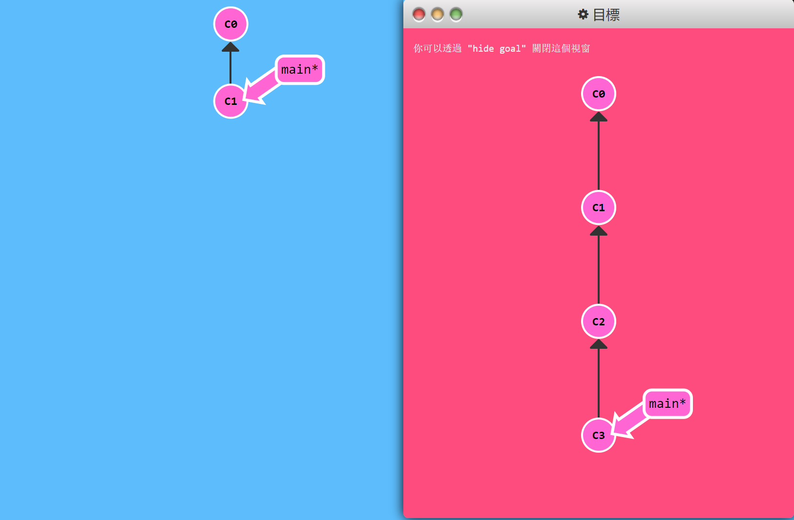
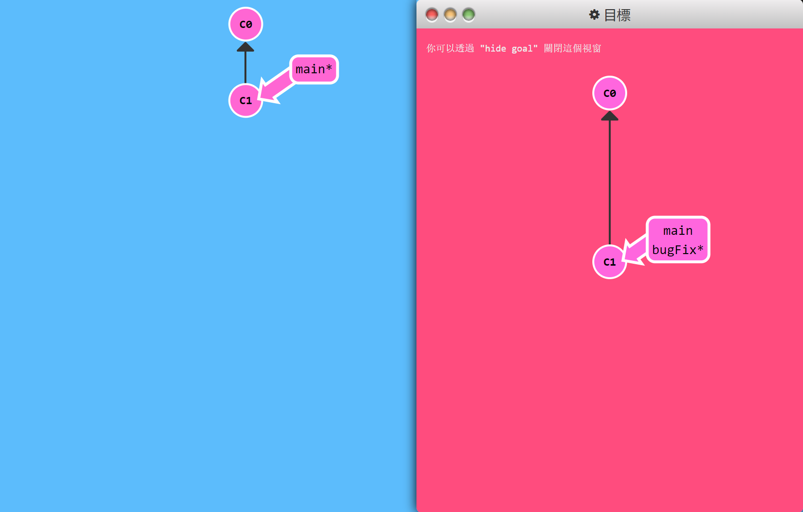
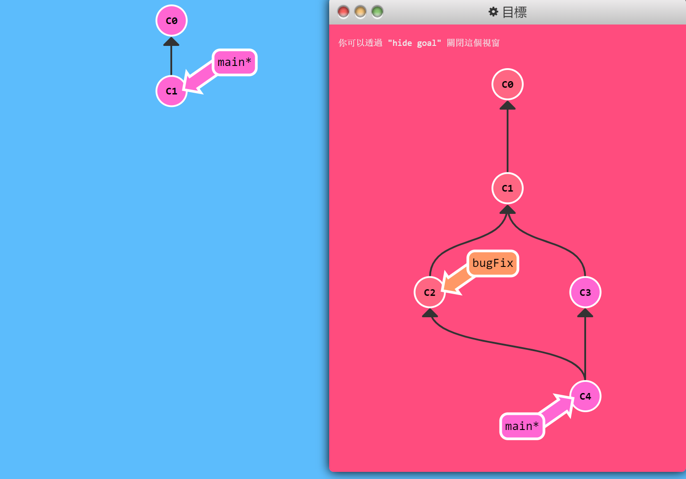
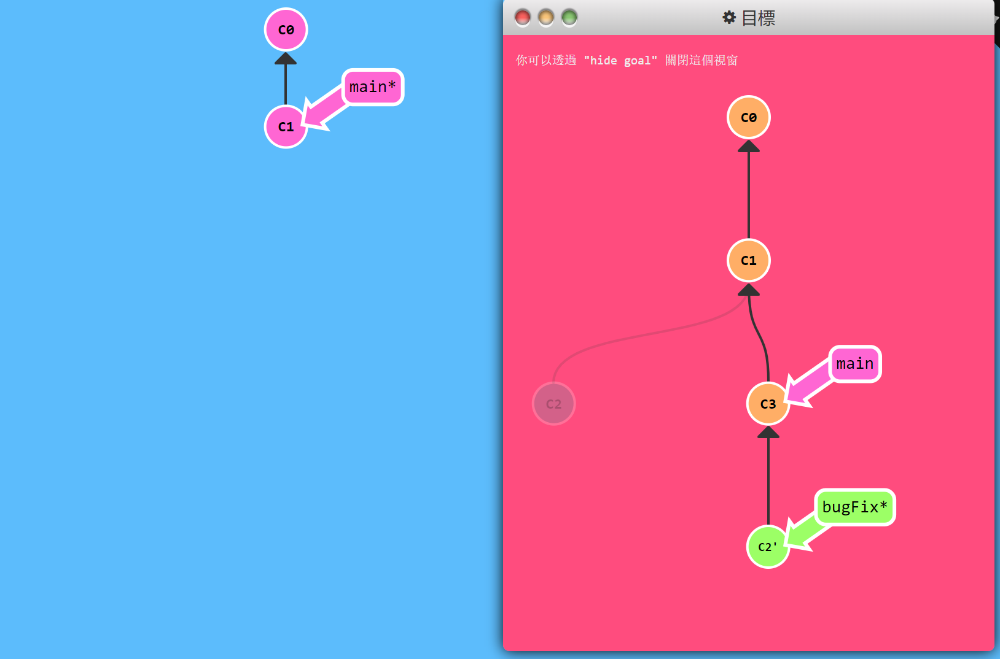
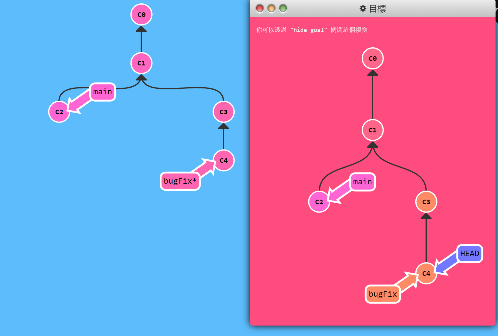
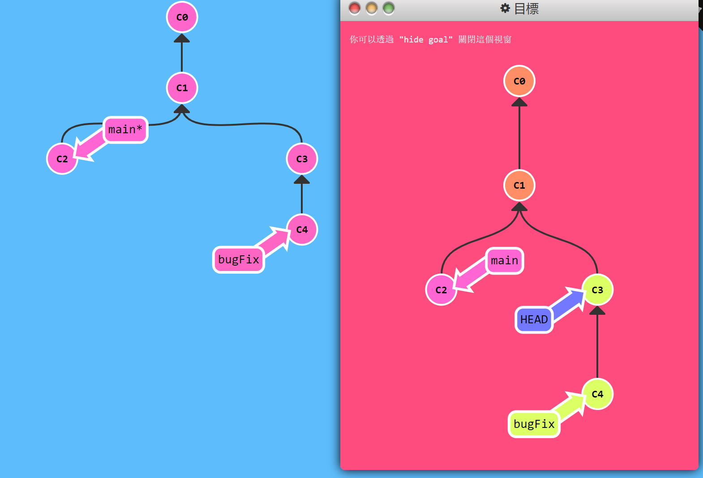
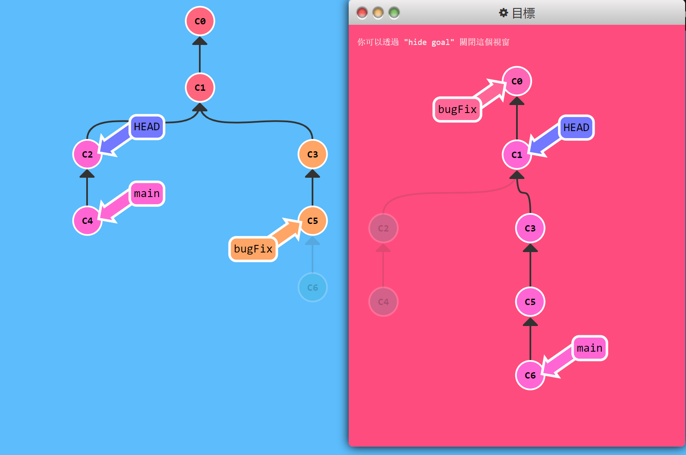
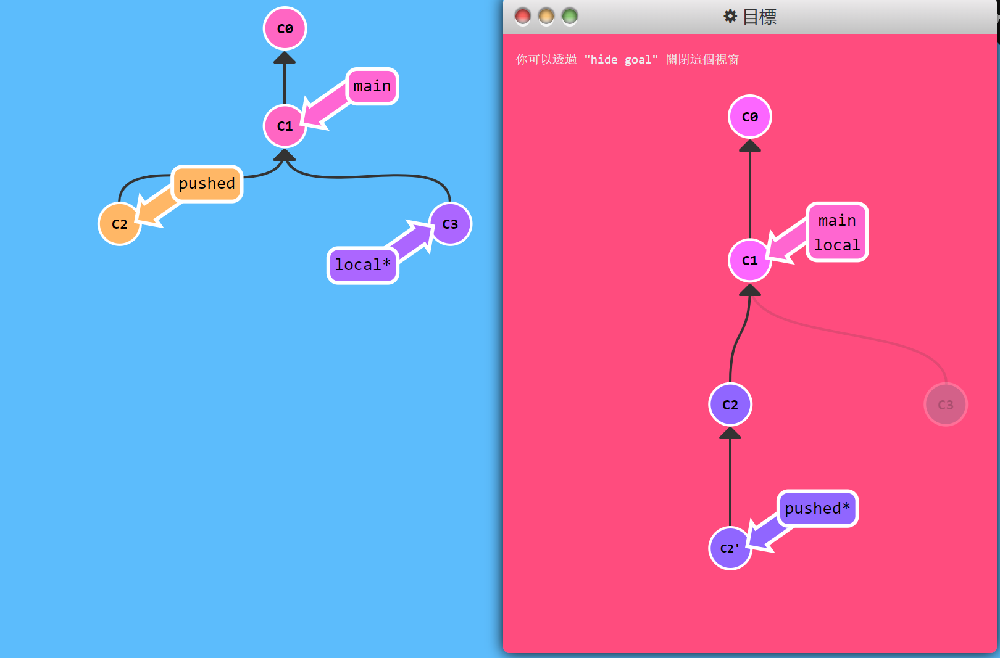

链接：https://learngitbranching.js.org/?locale=zh_CN

## 基础篇：

### 第一关：学习git commit

”

一個 commit 在 git repo 中會記錄目錄下所有文件的快照。感覺像是大量的複製和貼上，但 git 的速度更快！

git 希望 commit 儘可能地不占空間，所以每次進行 commit 的時候，它不會單純地複製整個目錄。實際上它把每次 commit 視為從目前的版本到下一個版本的變化量，或者說一個 "（delta）"。

git 會保存 commit 的歷史紀錄，所以，絕大部分的 commit 的上面都會有 parent commit，在我們的圖形表示中，箭頭方向表示從 parent commit 到所對應的 child commit，保存這樣子的一個歷史紀錄是非常有用的。

要學的東西有很多，但現在你可以把 commit 當作是當下的 project 的快照。commit 不佔空間且可以快速切換！

“



两次 git commit即可

```
git commit
git commit
```

### 第二关： 建立git branch

”

git 的 branch 只是一個指向某個 commit 的 reference，只要記住使用 branch 其實就是在說：「我想要包含這一次的 commit 以及它的所有 parent 的 commit。」

“



```
git branch bugFix
git checkout bugFix
```

### 第三关：git merge

”

一個 commit 如果有兩個 parent commit 的話，那就表示：「我想把這兩個 parent commit 本身及它們的 所有的 parent commit 都包含進來。」

“



先在bugfix commit ，再在main分支commit，最后merge

```
git branch bugFix
git checkout bugFix
git commit
git checkout main
git commit
git merge bugFix
```

### 第四关：git rebase

”

*rebasing* 是 merge branch 的第二種方法。rebasing 就是取出一連串的 commit，"複製"它們，然後把它們接在別的地方。

“



先commit bugFix分支，再commit main分支，最后切换到bugFix分支rebase到main上

```
git branch bugFix
git checkout bugFix
git commit
git checkout main
git commit
git checkout bugFix
git rebase main
```

## 进阶篇：

### 第一关：分离 HEAD

”

HEAD 是一個 reference，它是指向目前所 checkout 的 commit，基本上，其實就是你目前所在的 commit。

在 commit tree 中，HEAD 總是指向最近的一次 commit。大部份 git 的指令如果要修改 commit tree 的狀態的話，都會先改變 HEAD 所指向的 commit。

“



直接 checkout 到指定的 hash 值（圆圈里的值）即可

```
git checkout c4
```

### 第二关：相对引用

”

如果要在 git 中移動，透過指定 commit 的 hash 值的方式會變得比較麻煩。在實際例子中，你的終端機上面不會出現漂亮且具備視覺效果的 commit tree，所以你不得不用 `git log` 來查詢 hash 值。

另外，hash 值的長度在真實的 git 環境中很長。舉個例子，前一個關卡的介紹中的 commit 的 hash 值是 `fed2da64c0efc5293610bdd892f82a58e8cbc5d8`。舌頭不要打結了...

幸運的是，git 對於處理 hash 值很有一套。你只需要提供能夠唯一辨識出該 commit 的前幾個字元就可以了。所以，我可以只輸入 `fed2` 而不是上面的一長串字元。

使用相對引用，你可以從一個易於記憶的地方（比如說 branch 名稱 `bugFix` 或 `HEAD`）開始工作。

相對引用非常好用，這裡我介紹兩個簡單的用法：

* 使用 `^` 向上移動一個 commit
* 使用 `~<num>` 向上移動多個 commit

插入（^）這一個符號。把這個符號接在某一個 reference 後面，就表示你告訴 git 去找到該 reference 所指向的 commit 的 parent commit。

所以 `main^` 相當於 "`main` 的 parent commit"。

`main^^` 是 `main` 的 grandparent commit（往前推兩代）

切換到 main的 parent commit

“



切换到 bugFix 分支向前移动一次即可

```
git checkout bugFix^
```

### 第三关：相对引用（2）

”

 Git 也加入了波浪（~）符號。

波浪符號後面可以選擇一個數字（你也可以不選擇），該數字可以告訴 Git 我要向上移動多少個 commit,举例说明：

`git checkout HEAD~4`

可以使用 `-f` 選項直接讓分支指向另一個 commit。舉個例子:

`git branch -f main HEAD~3`

“



```
git checkout c1
git branch -f bugFix bugFix~3
git branch -f main c6
```

### 第四关：在git中取消修改

"

在 git 裡主要用兩種方法來取消修改，一種是 `git reset`，另外一種是 `git revert`。

`git reset` 把分支的參考點退回到上一個 commit 來取消修改。你可以認為這是在"重寫歷史"。`git reset` 往回移動 branch，原來的 branch 所指向的 commit 好像從來沒有存在過一樣。

雖然在你的 local branch 中使用 `git reset` 很方便，但是這種「改寫歷史」的方法對別人的 remote branch 是無效的哦！

為了取消修改並且把這個狀態*分享*給別人，我們需要使用 `git revert`。新的 commit `C2'` 引入了 *修改* ——用來表示我們取消 `C2` 這個 commit 的修改。

"

总结：git reset 相当于在本地回退到某个commit 版本，但是对别人没有影响，git reset相当于更新了一个包括修改的版本。



对c1进行reset，c2进行revert

```
git reset c1
git checkout pushed
git revert c2
```

## 调整提交顺序：
