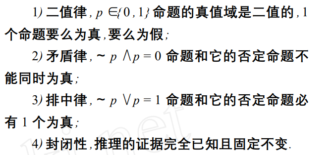

人工智能（Artificial Intelligence AI）

通用人工智能（Artificial General Intelligence AGI）

⼴义上讲，AGI是指具有合理程度的⾃我理解和⾃主⾃控能⼒的⼈⼯智能系统，能够在各种情况下解决各种复杂问题，并学会解决它们在创建时不知道的新问题。

 智能科学(Intelligence Science IS)

经典数理逻辑[1]

经典数理逻辑形成的原动力主要来自数学中的公理化运动,逻辑研究高度数学化，表现在：

1) 逻辑专注于研究在数学的形式化过程中提出的问题 ;
2) 逻辑采纳了数学的方法论 ,像数学那样用严格的形式证明去解决问题.

数学形态的经典数理逻辑便于机器理解和执行 ,因而促进了人工智能的诞生和早期发展 ,但后来的事实证明 ,许多现实世界的问题根本无法用经典数理逻辑解决. 原因在于经典数理逻辑的立论基础是“封闭全息的确定性世界假设”,其中排除了一切形式的不确定性、矛盾和演化 ,这导致了经典数理逻辑的“三律一性”。

---

### 参考文献

[1] 论第 2 次数理逻辑革命何华灿1,何智涛2,王 华1 (1. 西北工业大学 计算机学院 ,陕西 西安 710072 ;2. 北京航空航天大学 计算机学院 ,北京 100083)
