## 操作系统的整体概念

用户接口：提供操作界面

存储管理：分配内存空间

设备管理：分配设备资源

CPU：计算、处理

文件管理：创建、维护、访问目录、文件

调度：管理整个流程

## 第 1 章：绪论

### 操作系统概念

* 操作系统承担**与硬件相关、与应用无关的基本工作**，并解决这些基本工作中的效率和安全问题，为使用户能方便、高效、安全地使用计算机，而从最底层统一提供**通用**的帮助和管理。
* 现代操作系统的客户/服务器结构下，OS分为：运行在**用户态**并以客户/服务器方式活动的进程，运行在**核心态**的内核

从5个方面考察

* 科普观点：操作系统是计算机系统的管理指挥机构和控制中心。
* 功能观点：操作系统是计算机资源管理系统，负责对计算机的全部软、硬件资源进行分配、控制、调度和回收。
* 用户观点：操作系统是用户使用计算机的一个界面。
* 管理员观点：操作系统是计算机工作流程得以自动高效运行的组织者，系统软硬件资源合理协调的管理者。
* 软件观点：操作系统是由程序和数据集合组成的大型系统软件。

### 操作系统的发展历史

* 手工

  * 用户：用户既是程序员，又是操作员；用户是计算机专业人员；
  * 编程语言：为机器语言；
  * 输入输出：纸带或卡片；
* 批处理

  * 联机批处理：I/O设备与主机直接连接

    1. 用户将程序写在纸上
    2. 将作业穿孔成卡片，再将卡片盒交给操作员
    3. 操作员有选择地把若干作业合成一批，通过输入设备（纸带输入机或读卡机）输入
    4. 监督程序读入一个作业
    5. 从输入设备调入，编译、连接、运行程序
    6. 返回4，再读入一个作业，直到一批作业完成
    7. 返回3，处理下一批
  * 脱机批处理：增加一台不与主机直接相连而专门与I/O设备交换信息的卫星机
* 多道程序

  * 单道运行：每次只调一个用户作业程序进入内存并运行
  * 多道程序：进入系统的几道相互独立的程序均在运行
  * 相关技术问题

    * 处理机管理问题：如何分配，使CPU满足要求
    * 内存管理问题：为每道程序分配内存空间
    * I/O设备管理问题：如何分配I/O设备
    * 文件管理问题：如何组织程序和数据
    * 作业管理问题：如何组织作业
* 分时

  * 分时是指多个用户分享使用同一台计算机，分时共享硬件和软件资源。
* 实时

  * 用于工业过程控制、军事实时控制、金融等领域，包括实时控制、实时信息处理系统资源

目前的操作系统，通常具有分时、实时和批处理功能，又称作通用操作系统。可适用于计算、事务处理等多种领域，能运行在多种硬件平台上，如UNIX系统、WindowsNT等。

### 操作系统的基本类型

批处理、分时、实时、个人计算机、网络、分布式、嵌入式

* 实时操作系统主要用于过程控制、事务处理等有实时要求的领域，其主要特征是**实时性**和**可靠性**。
* 网络操作系统
  * 网络是一个互连的计算机系统群体，系统互连要通过通信设施实现
  * 其中的计算机是自治的，每台计算机均有自己的操作系统，各自独立工作，在网络协议控制下协同工作
* 分布式操作系统
  * 集中式计算机系统：处理和控制能力都高度集中在一台计算机上，所有任务均由它完成。
  * 分布式计算机系统：由多台分散的计算机经互联网络连接而成的系统。
  * 管理分布式计算机系统的操作系统称为分布式操作系统。

### 操作系统的功能

处理机管理、存储管理、设备管理、文件管理、用户接口

### 操作系统的特征

并发、共享、虚拟、异步

并发和并行

* 并发：指多个事件在同一时间段内发生。微观串行
* 并行（parallel）: 是指在同一时刻发生。微观并行

共享

* 多个进程共享有限的计算机系统资源。操作系统要对系统资源进行合理分配和使用。资源在一个时间段内交替被多个进程所用

虚拟

* 一个物理实体映射为若干个对应的逻辑实体——分时或分空间

异步

* 也称**不确定性**：指进程的执行顺序和执行时间的不确定性

### 现代操作系统特征

微内核、多线程、对称多处理、分布式、面向对象

### 习题

1、在下列操作系统中，(A)不具有用户独立性？

A. 批处理系统

B. 分时系统

C. 实时系统

D.以上三种系统都具有

2、在下列操作系统中，(B)交互性最强？

A. 单道批处理

B. 分时系统

C. 实时系统

D.多道批处理

3、在下列操作系统中，(C)及时性最强？

A. 单道批处理

B. 分时系统

C. 实时系统

D.多道批处理

4、在下列操作系统中，(C)不具有宏观上的同时执行性？

A. 实时系统

B.分时系统

C. 单道批处理

D.多道批处理

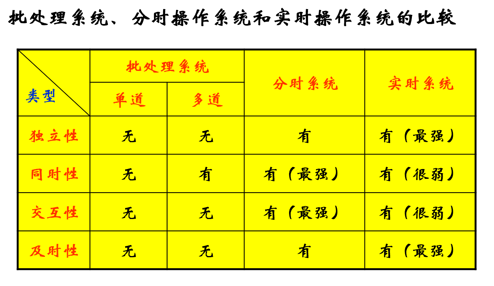

## 第 2 章：用户接口与作业管理

内存和外存、就绪状态、等待状态和完成状态

### 作业管理

#### **作业基本概念**

* 作业（用户角度、系统角度）
  * 系统角度：作业= 程序+数据（作业体）+ 作业说明书（作业控制语言）
    * 在批处理系统中，作业是抢占内存的基本单位，即以作业为单位将程序和数据调入内存。
  * 用户角度：在一次应用业务处理过程中，从输入开始到输出结束，用户要求计算机所作的有关该次业务处理的全部工作称为一个作业。
* 作业组织（作业、说明书、控制语言）
  * **作业说明书**：体现用户的控制意图
    包括作业基本情况、作业控制、作业资源要求的描述
    * 作业基本情况：用户名、作业名、编程语言、最大处理时间等
    * 作业控制描述：作业控制方式（脱机/联机）、作业步的操作顺序、作业执行出错处理
    * 作业资源要求描述：处理时间、优先级、内存空间、外设类型和数量、库函数或实用程序等
  * **作业控制语言**：用户用于描述批处理作业处理过程控制意图的一种特殊程序
    书写作业说明书的语言称为作业控制语言（JCL）

#### **作业的建立**

* 作业的输入、作业控制块的建立
* 作业输入方式

  * 联机输入、脱机输入、直接耦合、Spooling、网络
* 作业控制块的建立

#### SPOOLING系统

通过共享型设备来模拟独占型设备的动作，使**独占型**设备成为**共享型**设备，提高设备的利用率和系统的效率，这种设备被称
为虚拟设备，实现这一技术的硬件和软件系统被称为SPOOLing系统，或者假脱机系统。

### **用户接口**

操作系统提供的接口主要分两类1. 命令接口（操作级接口），用户利用这些操作命令来组织和控制作业的执行。2. 程序接口，编程人员可以用他们来请求操作系统服务。

* 程序级接口——系统为用户在程序一级提供有关服务而设置，由一组系统调用命令组成。
* 操作级接口——为用户提供各种命令
  * 脱机方式：用户通过JCL编写作业控制程序提交给系统，系统执行过程中用户无法干预（批处理，传统的脱机方式、命令文件）；
  * 联机方式：系统为用户提供操作命令，用户通过命令与系统对话，控制程序执行和管理计算机系统（用户直接参与控制作业执行）；
* 图形用户接口（ GUI, GRAPHIC USER INTERFACE ）（是调用了系统调用而实现的功能）
  * 在命令行方式下，用户与操作系统的交互要求用户记忆命令格式。在图形用户接口方式下，用户可利用鼠标对屏幕上的图标进行操作，完成与操作系统的交互，从而减少记忆内容，方便用户使用。它的技术基础是高分辩显示器和鼠标。

操作级接口（命令接口）提供给用户直接在键盘终端上交互式地使用，程序级接口提供给用户在编程时使用。

#### **系统调用（类、功能、实现过程）**

* 系统调用是操作系统提供给软件开发人员的唯一接口，开发人员可利用它使用系统功能。OS核心中都有一组实现系统功能的过程（子程序），系统调用就是对上述过程的调用。

#### 程序调用的功能

* 设备管理：设备的读写和控制
* 文件管理：文件读写和文件控制
* 进程控制：创建、中止、暂停等控制
* 进程通信：进程之间传递消息或信号
* 存储管理：内存的申请和释放
* 系统管理：设置和读取时间、读取
* 通过系统调用接口也可使用系统命令

  * C语言里的system()函数可调用shell来完成命令
  * 如 UNIX系统： system("cp -r doc /tmp")

#### 系统调用与普通过程调用

* 相同点
  * 改变指令流程
  * 重复执行和公用
  * 改变指令流程后需要返回原处CHEN
* 不同点
  * 执行状态不同：调用和返回经历了不同的系统状态。通常核心和应用程序的代码分别运行在CPU的不同的状态下（系统态/核心态/管态和用户态/目态），所用地址空间也不同――核心的代码可以直接访问应用进程的地址空间，反之不然。（系统调用和应用程序代码在执行时，它们运行在 CPU 的不同状态下，并使用不同的地址空间。）
  * 进入方式不同：利用int或trap指令进行系统调用；利用call或jmp指令进入普通的过程调用；
  * 返回方式：采用抢先式调度的系统，在系统调用返回时，要对系统中所有要求运行的进程进行优先级分析，并进行重新调度的检查――是否有更高优先级的任务就绪（创建或唤醒）

## 第 3 章：进程管理

为了描述程序在并发执行时对系统资源的共享，需要一个描述程序执行时动态特征的概念，这就是进程。

### 概述

#### 程序的执行

程序的执行有两种方式：顺序执行和并发执行。

**顺序执行**

具有独立功能的程序独占CPU直至得到最终结果的过程。

顺序执行是单道批处理系统的执行方式，也用于简单的单片机系统。

**顺序执行的特征**

* 顺序性：按照程序结构所指定的次序（可能有分支或循环）
* 封闭性：独占全部资源，计算机的状态只由该程序的控制逻辑所决定
* 可再现性：初始条件相同则结果相同。

**并发执行**

程序的并发执行是指一组在逻辑上互相独立的程序或程序段在执行时间上客观上互相重叠，即一个程序或程序段的执行尚未结束，另一个程序（段）的执行已经开始的执行方式。

* 并发：在一段时间（段）内的同时并行
* 并行：在同一物理时刻的同时

#### 进程进程的组成（程序+数据+PCB）

一个具有一定独立功能的程序在一个数据集合上的一次动态执行过程。

它对应虚拟处理机、虚拟存储器和虚拟外设等资源的分配和回收；

反映系统中程序执行的并发性、随机性和资源共享；

引入多进程，提高了对硬件资源的利用率，但又带来额外的空间和时间开销，增加了OS 的复杂性。

在计算机中处于运行状态的任何一个程序都是一个进程，一个进程拥有内存、CPU时间等一系列资源。

**进程的特征**

* 动态性：
  * 进程对应程序的执行
  * 进程是动态产生：创建→运行→消亡
  * 进程在其生命周期内，在三种基本状态之间转换
* 独立性：各进程的地址空间相互独立，除非采用进程间通信手段
* 并发性：任何进程都可以同其他进程一起向前推进
* 异步性：每个进程都以其相对独立的不可预知的速度向前推进
* 结构化：进程 = 代码段 + 数据段 + PCB

**进程与程序的区别**

* 进程与程序的组成不同：进程的组成包括程序、数据和进程控制块（即进程状态信息）。
* 进程与程序的对应关系：通过多次执行，一个程序可对应多个进程；通过调用关系，一个进程可包括多个程序。
* 进程具有并行特征，程序没有。进程具有独立性和异步性
* 进程是竞争计算机资源的基本单位。

#### 进程控制块PCB（作用、所包含信息）

* 进程控制块是由OS维护的用来记录进程相关信息和管理进程而设置的一个专门的数据结构，包含了进程的描述信息、控制信息和资源信息以及现场保护区。
* PCB是进程动态特性的集中反映
  * 系统通过PCB感知进程的存在，PCB随进程的创建而填写，随进程的撤消而释放
  * 系统通过PCB中所包含的各项变量的变化，掌握进程的状态以达到控制进程活动的目的
* PCB结构的全部或部分常驻内存；
* 系统利用PCB来控制和管理进程，所以PCB是系统感知进程存在的唯一标志
* 进程与PCB是一一对应的

**进程描述信息**

* 进程标识符 (process ID)，唯一，通常是一个整数
* 进程名，通常基于可执行文件名
* 用户标识符 (user ID)
* 进程组关系 (process group)

**进程控制信息**

* 当前状态
* 优先级 (priority)
* 代码执行入口地址
* 程序的外存地址
* 运行统计信息（执行时间、页面调度）
* 进程间同步和通信，阻塞原因

**资源占用信息**

虚拟地址空间的现状、打开文件列表

**CPU现场保护结构**

寄存器值（通用、程序计数器PC、状态PSW，地址包括栈指针）

#### 进程上下文（用户级、寄存器级、系统级）

进程上下文是对进程执行活动全过程的静态描述。进程上下文由进程的用户地址空间内容、硬件寄存器内容及与该进程相关的核心数据结构组成（正文段、数据集、堆栈）。

* 用户级上下文：进程的用户地址空间（包括用户栈各层次），包括用户正文段、用户数据段和用户栈；
* 寄存器级上下文：程序寄存器、处理机状态寄存器、栈指针、通用寄存器的值；
* 系统级上下文：
  * 静态部分（PCB和资源表格）
  * 动态部分：核心栈（核心过程的栈结构，不同进程在调用相同核心过程时有不同核心栈）

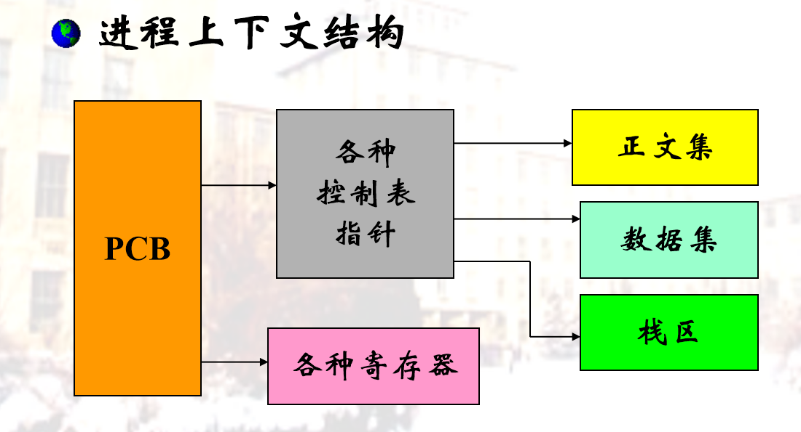

#### PCB的组织方式（链表、索引表）

PCB表：
系统把所有PCB组织在一起，并把它们放在内存的固定区域，就构成了 PCB表，PCB表的大小决定了系统中最多可同时存在的进程个数，称为系统的并发度。

**链表**

* 同一状态的进程其PCB成一链表，多个状态对应多个不同的链表
* 各状态的进程形成不同的链表：就绪链表、阻塞链表

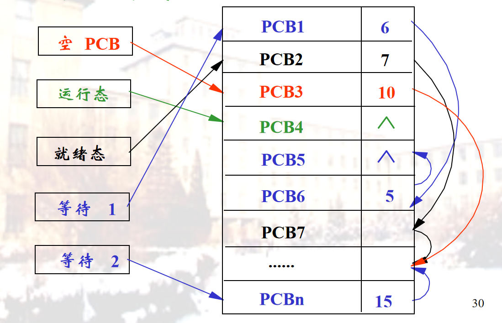

**索引表**

* 同一状态的进程归入一个index表（由index指向PCB），多个状态对应多个不同的index表
* 各状态的进程形成不同的索引表：就绪索引表、阻塞索引表

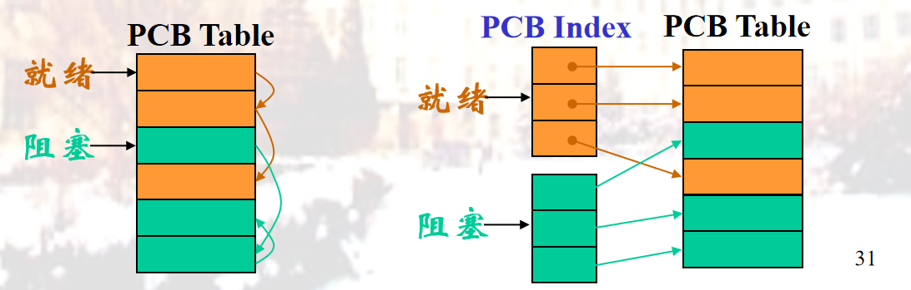

### 进程的状态及转换

#### 核心态和用户态

进程的执行状态可分为用户执行状态和系统执行状态
**用户执行状态**

又称用户态，进程的用户程序段执行时，该程序处于用户态。用户态时不可直接访问受保护的OS代码；
**系统执行状态**

又称系统态，核心态，进程的系统程序执行时，该进程处于系统态。核心态时可以执行OS代码，可以访问全部进程空间。

**划分用户态和系统态的原因**
把用户程序和系统程序分开，以利程序的保护和共享

但增加了系统复杂度和系统开销

进程

#### 内存中3种基本状态（转换、条件）

* 就绪态（Ready） ：一个进程已经具备运行条件，但由于无CPU暂时不能运行的状态（当调度给其CPU时，立即可以运行。位于“就绪队列”中
* 执行态（Running） ：进程占有了包括CPU在内的全部资源，并在CPU上运行
* 等待态（Blocked） ：阻塞态、挂起态、封锁态、冻结态、睡眠态。指进程因等待某种事件的发生而暂时不能运行的状态（即使CPU空闲，该进程也不可运行）。处于等待态的进程位于等待队列中

**相互转化**

在进程运行过程中，由于进程自身进展情况及外界环境的变化，这三种基本状态可以依据一定的条件相互转换

* 就绪→运行：调度程序选择一个新的进程运行
* 运行→就绪：
  * 运行进程用完了时间片
  * 运行进程被中断，因为一高优先级进程处于就绪状态
* 运行→等待：当一进程等待某一事件的发生时，如
  * 请求系统服务
  * 无新工作可做
* 等待→就绪：当所等待的事件发生时

#### 其他状态

**创建状态：创建( 新new)状态**

* OS 已完成为创建一进程所必要的工作

  * 已构造了进程标识
  * 已创建了管理进程所需的表格
* 但还没有允许执行该进程 (尚未同意)

  * 因为资源有限，OS所需的关于该进程的信息保存在主存中的进程表中，但进程自身还未进入主存，也没有为与这个程相关的数据分配空间，程序保留在辅存中。
* **导致进程创建的原因**

  * 批处理环境中，选择一新作业即将进入内存执行
  * 交互环境中，新用户登录到系统
  * 操作系统因提供一项服务而创建。如：用户请求打印一个文件，OS可创建严格管理打印的进程，使请求进程可继续执行，与完成打印任务的时间无关
  * 由现有进程生成，父进程----子进程

**终止状态（Exit）**

* 终止后进程移入该状态
* 它不再有执行资格
* 表格和其它信息暂时保留
* 实用程序为了分析性能和利用率，可能要提取程序的历史信息
* **导致终止进程的原因**

  * 含一个HALT指令或用于终止的OS显式服务调用
  * 分时系统中，用户的行为可指示终止，如：用户退出系统或关闭自己的终端，该用户的进程将被终止
  * PC机环境中，用户结束一应用程序
  * 出现某些错误时，如，I/O失败，无效指令等
  * 父进程可请求它的某个子进程终止
  * 父进程终止，OS自动终止所有后代进程

**挂起状态**

* 把一个进程从内存转到外存

#### 扩展：3状态、5状态、7状态（状态、转换、条件、数据结构等）

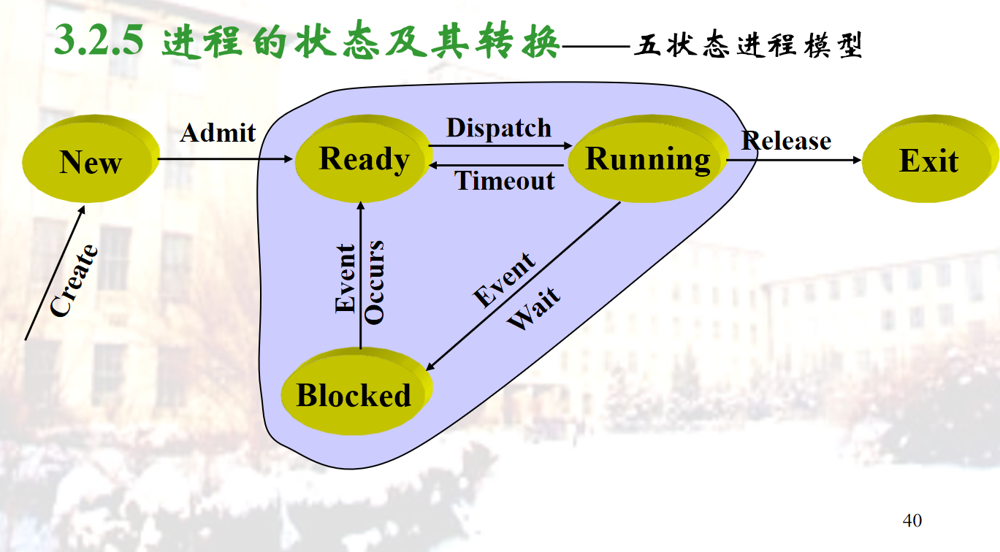

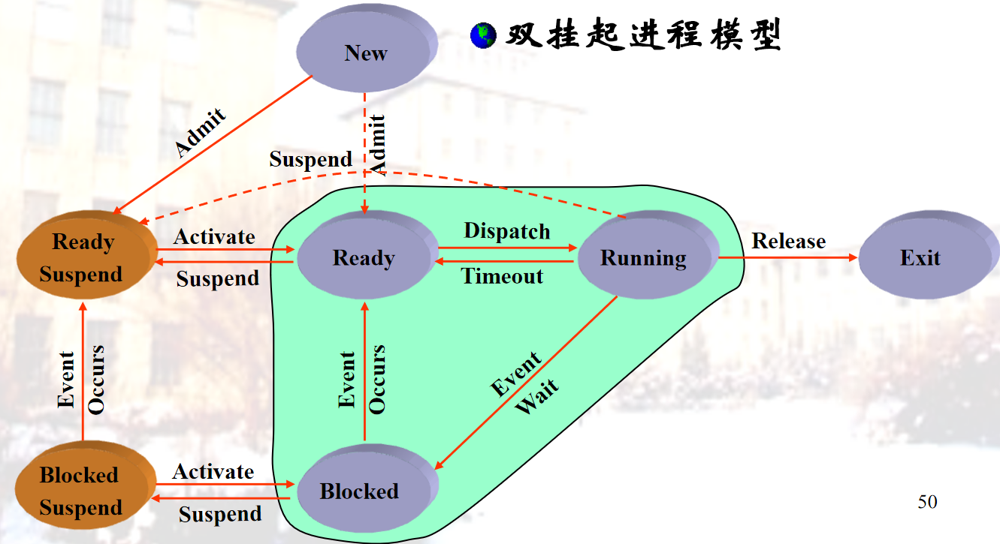

1. (多核CPU)如果系统中有N个进程，运行的进程最多几个，最少几个；就绪进程最多几个最少几个；等待进程最多几个，最少几个？

* 在有N个CPU的多核系统中，理论上最多可以有N个进程同时运行。
* 在多核系统中，这个数字会根据空闲CPU的数量而变化。
* 理论上，如果系统中的所有进程都在等待某个事件（例如I/O操作），那么所有进程都可以处于等待状态。

2. 单CPU环境下，如果系统中有N个进程，运行的进程最多几个，最少几个；就绪进程最多几个最少几个；等待进程最多几个，最少几个?

考虑单CPU的情况，

* 运行的进程最多有1个，最少0个。
* 就绪进程最多N-1个，最少0个。
* 等待进程最多N个，最少0个。

3. 在单处理机的分时系统中，分配给进程P的时间片用完后，系统进行切换，结果调度的仍然是进程P。有可能出现上述情形吗？如有可能请说明理由。

   有可能。
   若进程P的时间片用完后回到就绪队列时，就绪队列为空，P就是就绪队列的唯一进程，于是被调度；
   在按优先级调度的系统中，就绪队列按优先级排序，P时间片用完回到就绪队列时，若其优先级高于就绪队列其它进程，则被调度。

### 进程控制

**原语(primitive)**：由若干条指令构成的“原子操作(atomic operation)”过程，作为一个整体而不可分割--要么全都完成，要么全都不做。许多系统调用就是原语。

进程控制的主要原语：进程创建原语、进程阻塞原语、进程控制原语、激活原语Active、挂起原语。

#### 功能、原语、UNIX进程管理

**进程和线程**

**进程Process**：资源分配单位（存储器、文件）和CPU调度（分派）单位。多线程是指OS支持在一个进程中执行多个线程的能力

引入进程的目的：使多个程序能并发执行，以提高资源利用率和系统吞吐量；

**线程Thread**：作为CPU调度单位，而进程只作为其他资源分配单位，只拥有必不可少的资源，如：线程状态、寄存器上下文和栈，同样具有就绪、阻塞和执行三种基本状态

引入线程的目的：减少程序在并发执行时所付出的时空开销，使OS具有更好的并发性。

#### 进程同步互斥

每个信号量 s 除一个整数值 s.count（计数）, 还有一个进程等待队列  s.queue，其中是阻塞在该信号量的各个
进程的标识

P原语--P(s) 或wait(s)

在互斥问题中，申请使用临界资源时调用它。

```
P(Semaphore  s)
{
 --s.count;		//表示申请一个资源;
 if (s.count <0)	//表示没有空闲资源;
    {
        调用进程进入等待队列s.queue;
        阻塞调用进程;
    }
}
```

V原语—V(s) 或 signal(s) V原语通常唤醒进程等待队列中的头一个进程

功能：释放资源， 或唤醒进程

使用时机：进程退出临界区之后

```
V(Semaphore s )
{
 ++s.count;		  //表示释放一个资源；
 if (s.count <= 0)     //表示有进程处于阻塞状态；
 {
   从等待队列s.queue中取出一个进程P;
   进程P进入就绪队列;
 }
}
```

### 哲学家问题

5个哲学家围绕一张圆桌而坐，
桌子上放着5支筷子，每两个哲学家之间放一支；
哲学家的动作包括思考和进餐，
进餐时需要同时拿起他左边和右边的两支筷子，
思考时则同时将两支筷子放回原处。

一个信号量表示一根筷子，五个信号量构成信号量数组chop[5]，所有信号量初始值为1。第i个哲学家的进餐过程为：

```
思考问题
P(chop[i]);
P(chop(i+1) mod 5]);
进餐
V(chop[i]);
V(chop[(i+1) mod 5]);
```

该算法可保证两个相邻的哲学家不能同时进餐，但不能防止五位哲学家同时拿起各自左边的筷子、又试图拿起右边的筷子，这会引起死锁

### 读者写者问题

**管程**：管程是关于共享资源的数据结构及一组针对该资源的操作过程所构成的软件模块。

**生产者消费者问题**

```

生产者进程：
begin
    repeat
       produce an item;
       PC.put(item);
     until false;
end

消费者进程：
begin
    repeat
       PC.get(item);
       consume the item;
       until false;
end


```

1. 今有三个并发进程R，M，P，它们共享了一个可循环使用的缓冲区B，缓冲区B共有N个单元。进程R负责从输入设备读信息，每读一个字符后，把它存放在缓冲区B的一个单元中；进程M负责处理读入的字符，若发现读入的字符中有空格符，则把它改成“，”；进程P负责把处理后的字符取出并打印输出。当缓冲区单元中的字符被进程P取出后，则又可用来存放下一次读入的字符。请用PV操作为同步机制写出它们能正确并发执行的程序。
2. 有一个仓库可以存放A、B两种物品，每次只能存入一件物品（A或B）。存储空间足够大，只是要求 –n<(A的件数 – B的件数) < m , 其中n和m是正整数。试用存入A、存入B和P、V操作，描述物品A和物品B的入库过程。
3. 用管程描述生产者和消费者问题

### 死锁

一组进程中，每个进程都无限等待被该组进程中另一进程所占有的、因而永远无法得到的资源，这种现象称为进程死锁，这一组进程就称为死锁进程。

死锁发生的原因

* 竞争资源：为多个进程所共享的资源不足，引起它们对资源的竞争而产生死锁。
  * m个资源，n个进程，若每个进程均要求i个资源，当m<ni时就可能产生死锁
* 并发执行的顺序不当。进程运行过程中，请求和释放资源的顺序不当，而导致进程死锁
  * 资源使用模式：“申请--分配--使用--释放”模式
* 两种资源
  * 可重用资源(reusable resource)：每个时刻只有一个进程使用，但不会耗尽，在宏观上各个进程轮流使用。如CPU、主存和辅存、I/O通道、外设、数据结构如文件、数据库和信号量。有可能剥夺资源：由高优进程剥夺低优进程，或OS核心剥夺进程。
  * 可消费资源（ consumable resource ）：可以动态生成和消耗，一般不限制数量。但当进程得到一个资源时，该资源就不存在了。如硬件中断、信号、消息、缓冲区内的数据。

只有4个条件都满足时，才会出现死锁。

* 互斥(Mutual exclusion)：任一时刻只允许一个进程使用资源
* 请求和保持(Request and hold)：进程在请求其余资源时，不主动释放已经占用的资源
* 非剥夺(Nonpreemptive)：进程已经占用的资源，不会被强制剥夺
* 环路等待(Circular Wait)：环路中的每一条边是进程在请求另一进程已经占有的资源。

#### 银行家算法（避免死锁)

一个**银行家**把他的**固定资金（capital）** 贷给若干 **顾客**。只要不出现一个顾客借走所有资金后还不够，银行家的资金应是安全的。银行家需一个算法保证借出去的资金在有限时间内可收回。
假定顾客分成若干次进行；并在第一次借款时，能说明他的最大借款额。
具体算法：
顾客的借款操作依次顺序进行，直到全部操作完成；
银行家对当前顾客的借款操作进行判断，以确定其安全性（能否支持顾客借款，直到全部归还）；
安全时，贷款；否则，暂不贷款。

## 第 4 章：处理机调度

处理机管理的工作是对CPU资源进行合理的分配使用，以提高处理机利用率，并使各用户公平地得到处理机资源。

### 调度的层次

第1级：作业调度、宏观调度、高级调度

* 对外存输入井上的大量作业进行选择，对选择的作业分配资源，建立相应进程
* 作业执行完毕时，回收资源。
* 发生频率：最低

第2级：交换调度、中级调度

* 将处于外存交换区中的就绪状态或等待状态的进程调入内存，
* 或把处于内存就绪状态或内存等待状态的进程交换到外存交换区
* 发生频率：中等

第3级：进程调度、微观调度、低级调度

* 选取一个处于就绪状态的进程占用处理机，之后，进行上下文切换以便建立与占用处理机进程相适应的执行环境。
* 发生频率：最高

第4级：线程调度

* 选取一个处于就绪状态的线程进入执行状态。

### 调度算法的评价指标

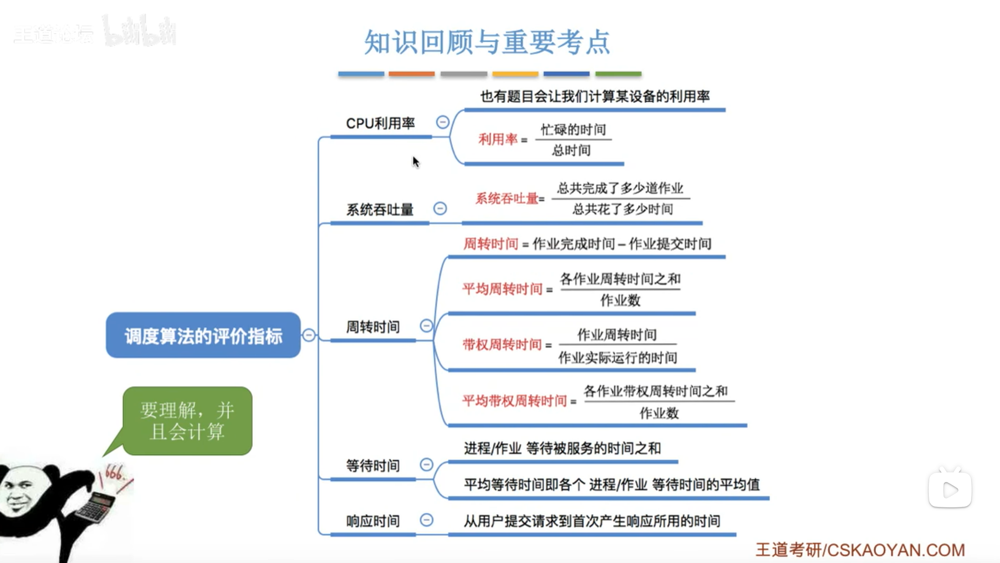

### 先来先服务(FCFS)

简单的调度算法，按先后顺序进行调度。
 FCFS算法

* 按照作业提交或进程变为就绪状态的先后次序，分派CPU
* 当前作业或进程占用CPU，直到执行完或阻塞，才出让CPU（非抢占方式）
* 在作业或进程唤醒后（如I/O完成），并不立即恢复执行，通常等到当前作业或进程出让CPU。最简单的算法

FCFS特点

* 比较有利于长作业，而不利于短作业
* 有利于CPU繁忙的作业，而不利于I/O繁忙的作业

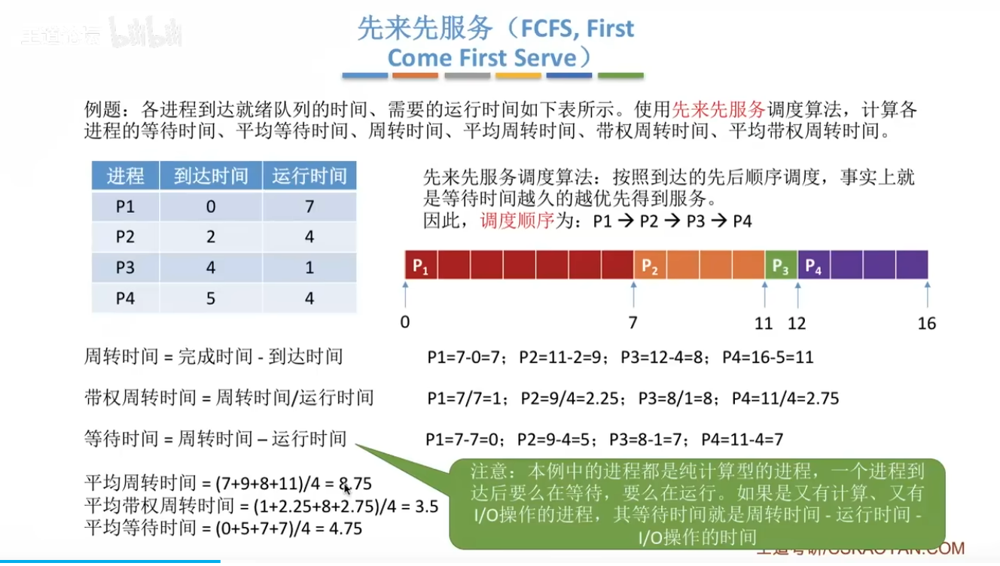

### 短作业优先 (SJF, Shortest Job First)

* 又称为“短进程优先”SPN(Shortest Process Next)；这是对FCFS算法的改进，其目标是减少平均周转时间，为非抢占式。

SJF算法

* 对预计执行时间短的作业（进程）优先分派处理机。通常后来的短作业不抢先正在执行的作业

SJF优点

* 比FCFS改善**平均周转时间**和**平均带权周转时间**，缩短作业的**等待时间**
* 提高系统的吞吐量

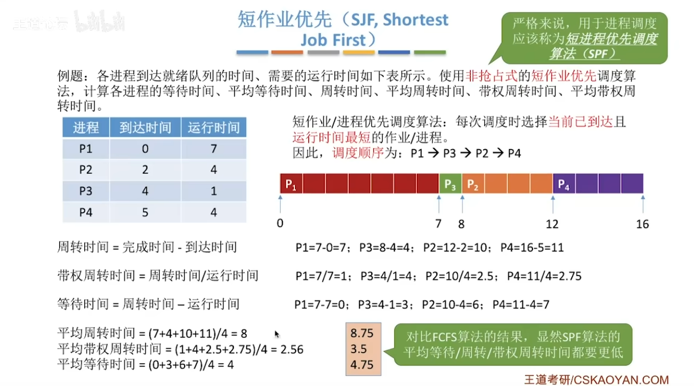

SRTN算法

改进版本“最短剩余时间优先（SRTN）”为抢占式的短作业优先算法。

* 每当有进程加入就绪队列改变时就需要调度，如果新到达的进程剩余时间比当前运行的进程剩余时间更短，则由新进程抢占处理机，当前运行进程重新回到就绪队列。另外，当一个进程完成时也需要调度。

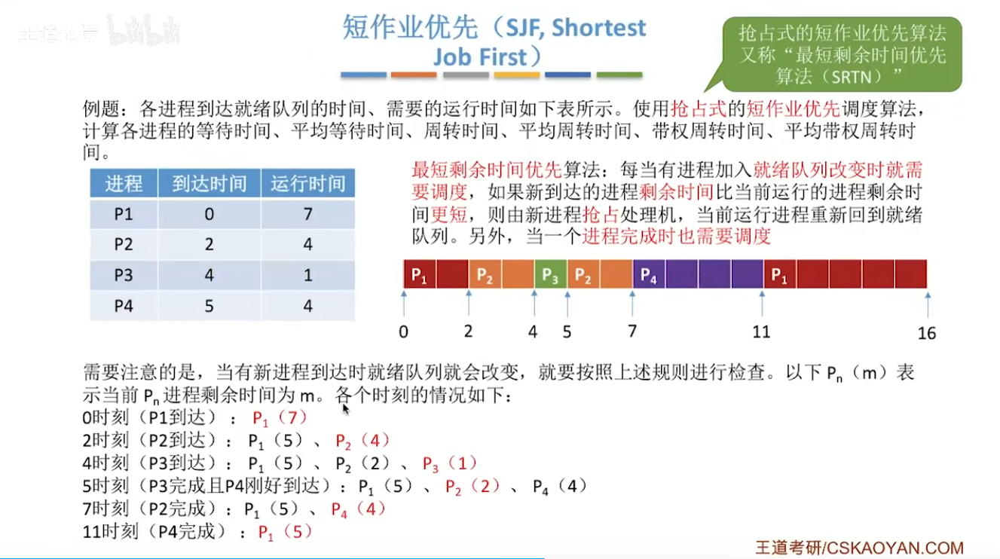

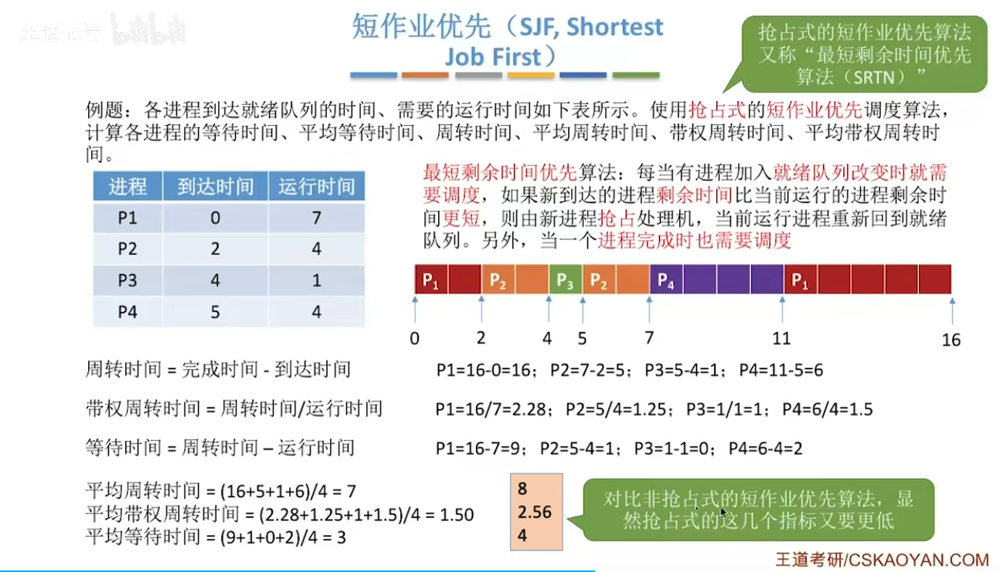

**如果题目中未特别说明，所提到的“短作业/进程优先算法”默认是非抢占式的**

### 最高响应比优先（HRR）

响应比最高的作业优先启动

**响应比R**
  =(作业处理时间Tri+作业等待时间Twi )/作业处理时间Tri
  = 1 +(作业等待时间Twi / 作业处理时间Tri )

该算法是FCFS和SJF的结合，克服了两种算法的缺点

* 优点: 公平，吞吐率大
* 缺点: 增加了计算，增加了开销

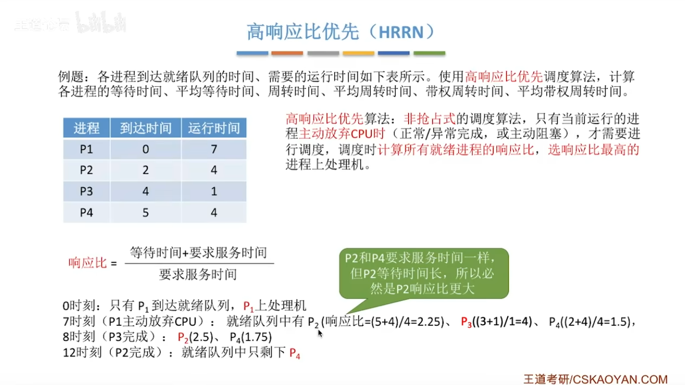

### 时间片轮转算法 (Round Robin)

* 前两种算法主要用于宏观调度，说明怎样选择一个进程或作业开始运行，开始运行后的作法都相同，即运行到结束或阻塞，阻塞结束时等待当前进程放弃CPU
* 本算法主要用于微观调度，说明怎样并发运行，即切换的方式；设计目标是提高资源利用率，
* 其基本思路是按照各进程到达就绪队列的顺序，轮流让各个进程执行一个时间片(如100ms)。若进程未在一个时间片内执行完则剥夺处理机，将进程重新放到就绪队列队尾重新排队。通过时间片轮转，提高进程并发性和响应时间特性，从而提高资源利用率
* 时间片长度变化的影响
  * 过长:退化为FCFS算法，进程在一个时间片内都执行完，响应时间长
  * 过短:用户的一次请求需要多个时间片才能处理完，上下文切换次数增加，响应时间长
* 对响应时间的要求
  T(响应时间)=N(进程数目)*q(时间片)

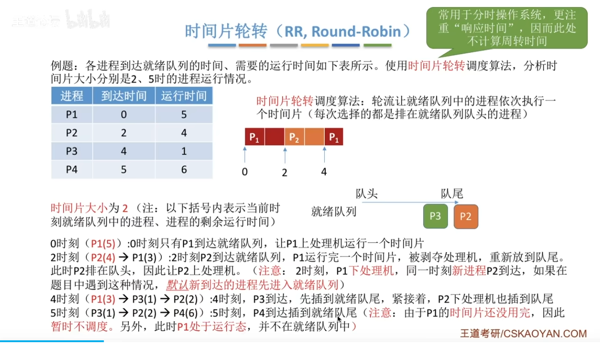

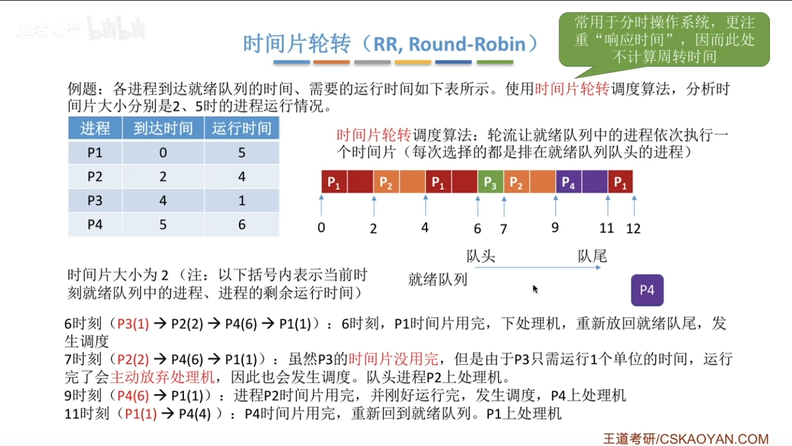

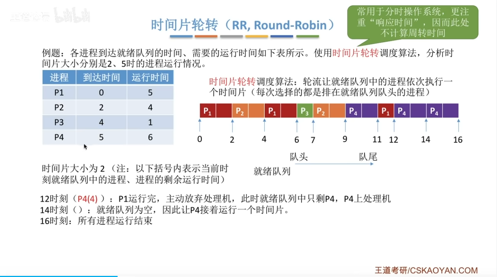

### 多级队列算法(Multiple-level Queue)

本算法引入多个就绪队列，通过各队列的区别对待，达到一个综合的调度目标
多级队列算法

* 根据作业或进程的性质或类型的不同，将就绪队列再分为若干个子队列；
* 每个作业固定归入一个队列
* 各队列的不同处理：不同队列可有不同的优先级、时间片长度、调度策略等。如：系统进程、用户交互进程、批处理进程等。

### 优先级算法

是多级队列算法的改进，平衡各进程对响应时间的要求。适用于作业调度和进程调度，可分成抢先式和非抢先式
静态优先级

定义：创建进程时就确定，直到进程终止前都不改变。通常是一个整数。

依据

* 进程类型（系统进程优先级较高）
* 对资源的需求（对CPU和内存需求较少的进程，优先级较高）
* 用户要求（紧迫程度和付费多少）

非抢占式

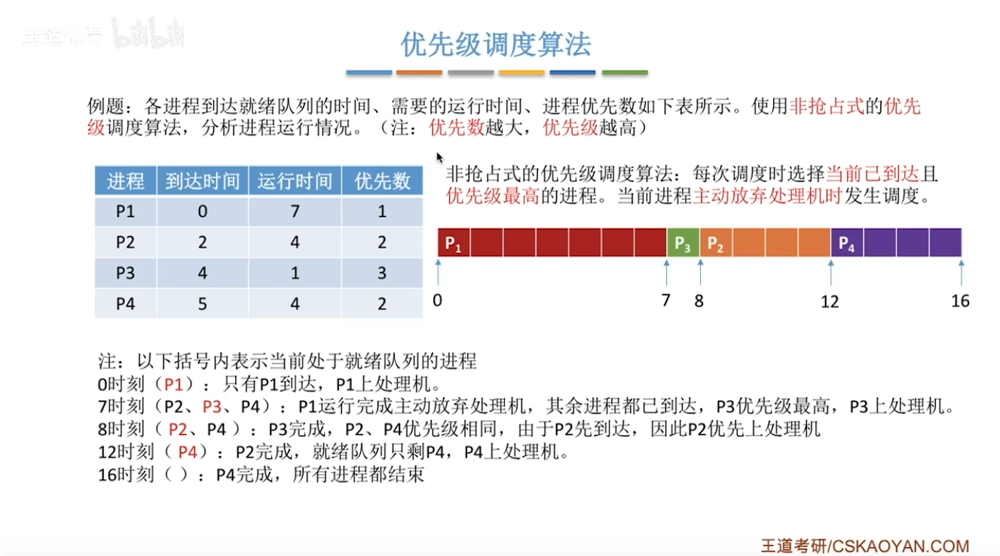

抢占式

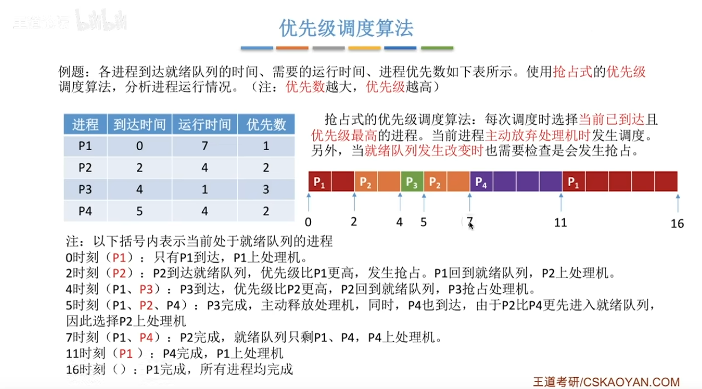

### 多级反馈队列算法 (Round Robin with Multiple Feedback)

是时间片轮转算法和优先级算法的综合和发展。

优点:

* 为提高系统吞吐量和缩短平均周转时间而照顾短进程
* 为获得较好的I/O设备利用率和缩短响应时间而照顾I/O型进程
* 不必估计进程的执行时间，动态调节

算法

* 设置多个就绪队列，分别赋予不同的优先级，如逐级降低，队列1的优先级最高。每个队列执行时间片的长度也不同，规定优先级越低则时间片越长，如逐级加倍；
* 新进程进入内存后，先投入队列1的末尾，按FCFS算法调度；若按队列1一个时间片未能执行完，则降低投入到队列2的末尾，同样按FCFS算法调度；如此下去，降低到最后的队列，则按“时间片轮转”算法调度直到完成；
* 仅当较高优先级的队列为空，才调度较低优先级的队列中的进程执行。如果进程执行时有新进程进入较高优先级的队列，则抢先执行新进程，并把被抢先的进程投入原队列的末尾。

## 第 5 章：存储管理

### 存储管理的功能和目标

* 进程中的目标代码、数据等的虚拟地址组成的虚拟空间称为虚拟存储器（virtual store or memory）,虚拟存储器不考虑物理存储器的大小和信息存储的实际位置，只规定每个进程中互相关联的信息的相对位置。
* 在程序装入时，不必将其全部读入内存，而只需将当前需要执行的部分读入到内存，就可让程序开始执行
* 在程序执行过程中，如果需执行的指令或访问的数据尚未在内存，则由处理器通知操作系统将相应部分调入内存，然后继续执行程序
* 另一方面，操作系统将内存中暂时不使用的部分调出保存在外存上，从而腾出空间存放将要装入的部分
* 通过物理内存和外存相结合，提供大范围的虚拟地址空间——可使用的总容量不超过物理内存和外存交换区容量之和

虚拟存储器
存储管理的功能
地址变换
内外存数据传输的控制
内存的分配与回收
内存信息的共享与保护

存储体系
存储管理任务
段式存储管理
页式存储管理
段页式
虚拟存储技术
交换技术

## 第 6 章：文件管理

主要内容：

文件基本概念
磁盘结构
文件目录
文件系统使用
文件系统安全
外存空间管理

### 引言

### 文件管理的目的

### 基本概念（文件、目录、文件分类）

**文件**

文件是具有文件名的一组相关元素的有序集合。文件名是文件的标识符号。相关字符流的集合（无结构文件）或相关记录的集合（有结构文件）。文件包括两部分：

* 文件体：文件本身的信息；
* 文件说明：文件存储和管理信息；如：文件名、文件内部标识、文件存储地址、访问权限、访问时间等
  * 文件的属性：包括文件类型、文件长度、文件的物理位置、文件的建立时间

文件类型：

* 按用途分：系统文件、用户文件、库文件
* 按数据形式分：源文件、目标文件、可执行文件
* 按存取控制属性分：只执行文件、只读文件、读写文件
* 按组织形式和处理方式分
  * 普通文件：ASCII码或二进制码组成的字符文件
  * 目录文件：由文件目录组成
  * 特殊文件：系统中各类I/O设备

**文件分类**

* 按存放时限分类：根据系统保留文件的时间：临时文件、永久文件和档案文件。
* 按设备类型分类：根据文件存储介质的设备类型：磁盘文件、磁带文件、卡片文件和打印文件等。
* 按文件的组织结构分类:
  * 文件的逻辑结构：从用户观点出发观察到的文件组织
  * 文件的物理结构：文件的存储结构，即文件在外存的存储组织形式。涉及存储介质、外存分配方式

**目录**

### 文件系统的结构和功能元素

### 文件的组织

文件的组织

* 逻辑结构
* 物理结构

### 文件目录

* 内容
* 结构
* 别名的实现（硬连接、符号连接）

### 文件目录的访问和使用

* 文件的访问
* 文件的控制
* 目录管理
* 伪文件

### 文件共享和访问控制

* 存取控制
* 共享：一个文件可以让指定的某些用户共同使用

  * 节省空间
  * 免除系统复制文件的重复性工作
  * 减少访问外存次数（文件复制增加外存访问次数)
  * 保证信息一致性

  **静态文件共享：**

  基于基本目录共享法

  设置一个基本文件目录，每个目录相对应一个文件，记录文件的唯一标识符ID、文件的存取控制管理信息、文件的物理地址等。

  基于符号链共享方式

  为使目录B能共享C的一个文件F，由系统创建一个Link类型的新文件，也取名为F，并将F写入B的目录中，以实现B的目录与文件F的链接。新文件中只包含被链接文件F的路径名。

  **动态文件共享：**

  当多个用户同时打开某一文件对其访问时，在内存中建立打开文件结构：进程打开文件表、系统打开文件表、文件的内存索引节点。

  **共享语义：**

  规定了一个用户对共享数据的修改何时对另一个用户可见，这种语义通常由文件系统功能决定
* 访问权限

  * 用户范围类型：指定用户、用户组、任意用户
  * 访问类型和用户范围的组合
    * 访问矩阵：矩阵的一维是每个目录和文件，另一维是用户范围，每个元素是允许的访问方式
    * 存取控制表：以文件为单位，把用户按某种关系划分为若干组，同时规定每组的存取权限。实现时，该表放在文件说明中，打开文件时，被复制了内存中；效率高
* 并发访问
* 安全、可靠性

### 文件存储空间管理

* 存储设备
* 空间分配
* 磁盘空闲空间管理
* 文件卷

### 文件系统层次模型

## 第 7 章：设备管理

设备分类
设备独立性
I/O软件组成
设备分配
虚设备技术
缓冲技术
通道技术
磁盘调度

### 缓冲技术

* 缓和CPU与I/O设备之间速度不匹配的矛盾
* 减少对CPU的中断频率，放宽对CPU中断响应时间的限制
* 提高CPU和I/O设备之间的并行性

#### 单方向缓冲（IO->CPU)

单缓冲：一个缓冲区，CPU和外设轮流使用，一方处理完之后接着等待对方处理

双缓冲：两个缓冲区，CPU和外设都可以连续处理而无需等待对方。要求CPU和外设的速度相近

环形缓冲：多个缓冲区，CPU和外设的处理速度可以相差较大

#### 缓冲池组成

* 三种缓冲区队列：emq，inq，outq
* 四个工作缓冲区：hin，sin，hout，sout
* 四种操作：收容输入、提取输入、收容输出、提取输出

### 设备分配

**数据结构**

* 设备控制表（DCT）：每个设备一张，记录本设备的情况
* 控制器控制表（COCT）：每个控制器一张，记录本控制器的情况；
* 通道控制表（CHCT）：每个通道一张。
* 系统设备表（SDT）：记录系统中全部设备的情况，每个设备占一个表目。

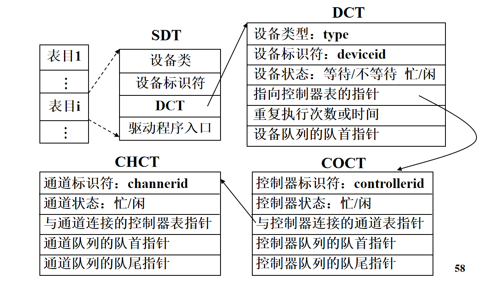

## 附录：英文缩写对应

主文件目录：MFD

用户文件目录：UFD

文件控制块：FCB

基本文件目录：BFD

标识符：ID

空闲文件目录：FFD

符号文件目录：SFD
